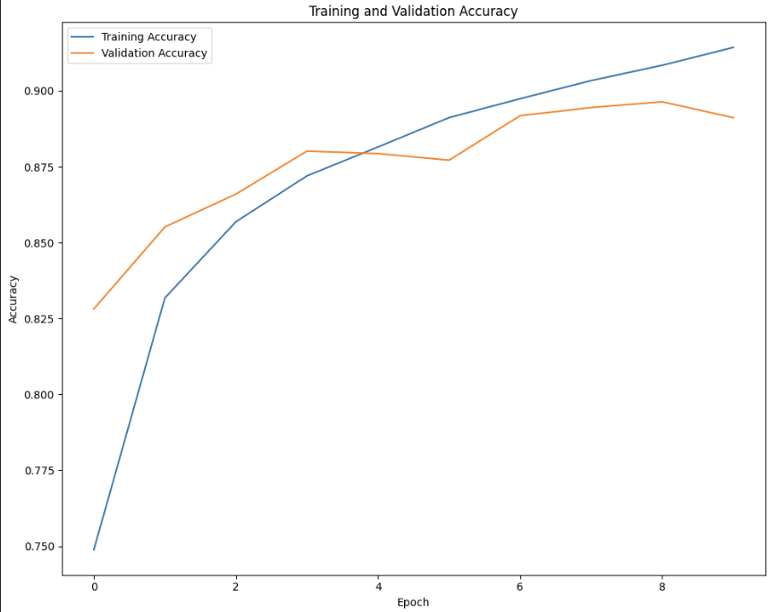

### 1. Introduction and Objective

**Dataset Description:**  
The Fashion MNIST dataset contains grayscale images of 10 different categories of clothing items, including T-shirts/tops, trousers, pullovers, dresses, coats, sandals, shirts, sneakers, bags, and ankle boots. Each image is represented by 784 pixel values, and the dataset includes a total of 10 classes. The train dataset contains a label column indicating the class of the item, along with 784 pixel values for each image.

**Objective:**  
The objective of this project is to build a neural network model that accurately classifies images in the Fashion MNIST dataset into one of the 10 categories: T-shirts/tops, trousers, pullovers, dresses, coats, sandals, shirts, sneakers, bags, or ankle boots.

### 2. Data Preparation
**Loading the data**
The training and testing data were loaded from CSV files, which contained pixel values and labels for each image. The pixel values, originally spread across multiple columns, were separated from the labels and reshaped into their original 28x28 pixel dimensions to match the format required for model input.

**Data Normalization**

To ensure that the data is in an appropriate range for the neural network, the pixel values were scaled down to a range between 0 and 1. This normalization step is important for improving the efficiency and accuracy of the model during training.

**Training and Validation Data**

The training data was optionally divided into two parts: one for training the model and the other for validating its performance during development. This split helps in assessing how well the model is likely to perform on unseen data.

### 3. Layer Descriptions

**Convolutional Layer 1**
The first layer of the model is a convolutional layer that uses 32 filters to scan the images and detect basic features such as edges. This layer takes in images of size 28x28 pixels and works with grayscale (single channel) images.

**Max Pooling Layer 1**
The first max pooling layer follows the convolutional layer and reduces the size of the images by half. This layer helps to simplify the data and make the model faster and more efficient.

**Convolutional Layer 2**
The next layer is another convolutional layer that uses 64 filters to identify more complex patterns in the images, building on the features detected by the first layer.

**Max Pooling Layer 2**
The second max pooling layer again reduces the size of the images by half, continuing to make the model more efficient.

**Convolutional Layer 3**
This layer uses 128 filters to capture even more detailed and complex features from the images.

**Max Pooling Layer 3**
The third max pooling layer further reduces the image size, keeping the model's data manageable and focused.

**Flatten Layer**
This layer changes the 2D image data into a 1D format, making it ready for the final layers of the model.

**Dense Layer**
This fully connected layer with 128 units helps the model make sense of the features extracted from the images and learn how to classify them.

**Output Layer**
The final layer provides the classification results. It has 10 units, each representing one of the 10 clothing categories. It uses a softmax function to give the probability of each category, allowing the model to choose the most likely class for each image.

### 4. Training Process

**Loss Function and Optimizer:**

- **Loss Function:** We use **sparse categorical cross-entropy** to measure how close the model’s guesses are to the actual categories of the images. This approach is good for our task because it works well with integer labels for our 10 different clothing categories and is best suited for multi-class classification.

- **Optimizer:** The **Adam** optimizer is used to train the model.

**Training Process:**

During training, the model looks at the images and their labels multiple times (10 epochs) to learn how to classify them correctly. We also use a separate set of images (validation data) to keep track of how well the model is performing. The `history` object helps us monitor the model’s learning progress, showing how its accuracy improves over time and letting us know if it’s learning well or if any adjustments are needed.

### 5. Visualization
The following visualizations are used to understand the model’s performance better:

- **Training and Validation Accuracy:** This plot shows how the model’s accuracy on both training and validation data changes over time.

  

- **Precision-Recall Curve:** This curve plots precision versus recall for each class, helping to evaluate the model’s performance on individual classes.

  

- **Training and Validation Loss:** This plot shows how the loss changes during training and validation, helping to track how well the model is learning and if there are any signs of overfitting.

  

- **Validation and Test Loss:** This plot compares the loss on validation data with the loss on test data, helping to understand how the model performs on unseen data over time.

  
- **Confusion Matrix:** The confusion matrix provides a detailed breakdown of the model's predictions, showing how often each class was correctly predicted or misclassified as another class. This helps in identifying specific areas where the model may be confused between similar classes.

  

These metrics and visualizations offer a comprehensive view of the model’s performance, revealing its strengths and highlighting areas for improvement.

### 6. Conclusion
**Summary of Results**

A convolutional neural network (CNN) was developed to classify images from the Fashion MNIST dataset into 10 categories. The model achieved:

- **Test Accuracy:** 89.44%
- **Test Loss:** 0.468

**Key Findings**

- The model performed well, achieving high accuracy and manageable loss values.
- The choice of loss function and optimizer contributed positively to the model's performance.

