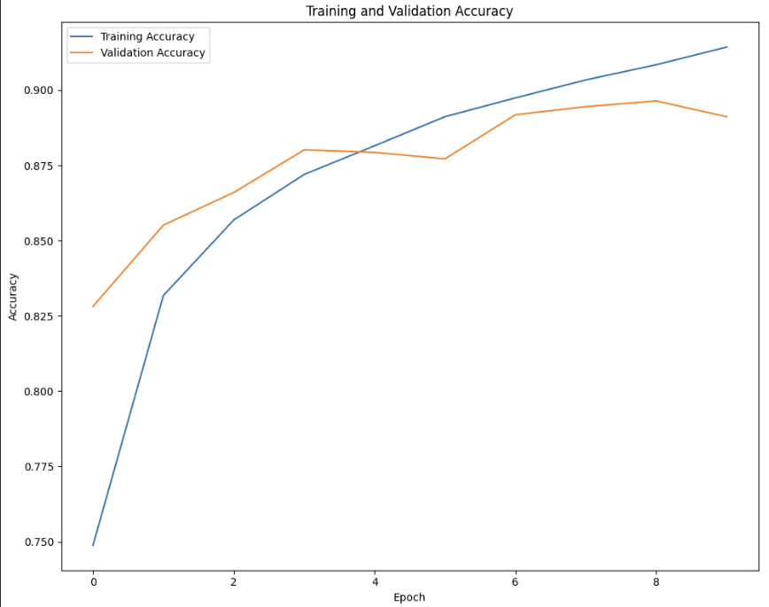
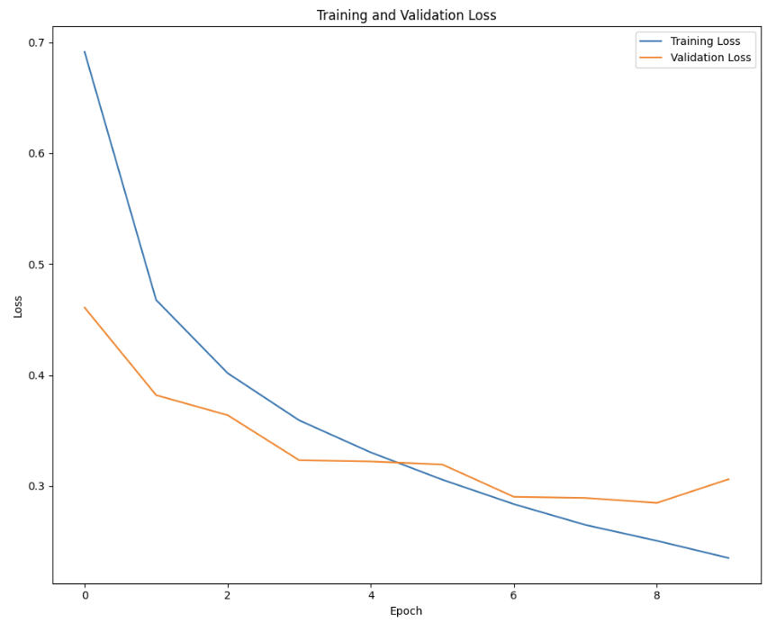
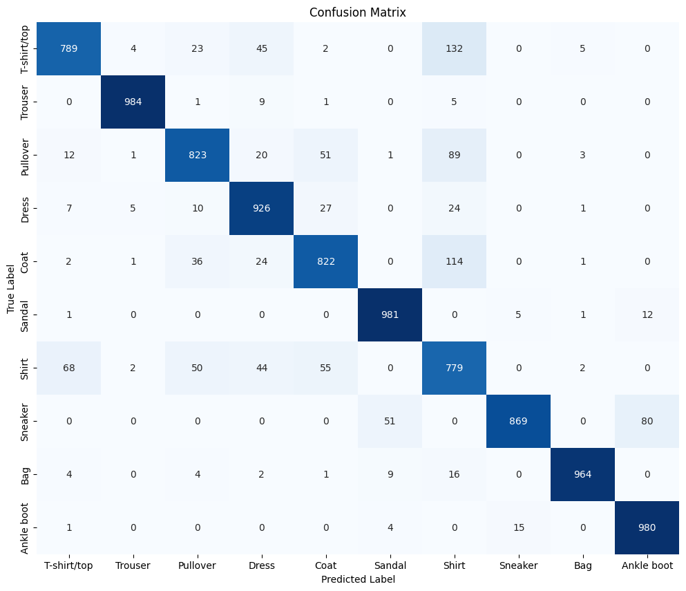
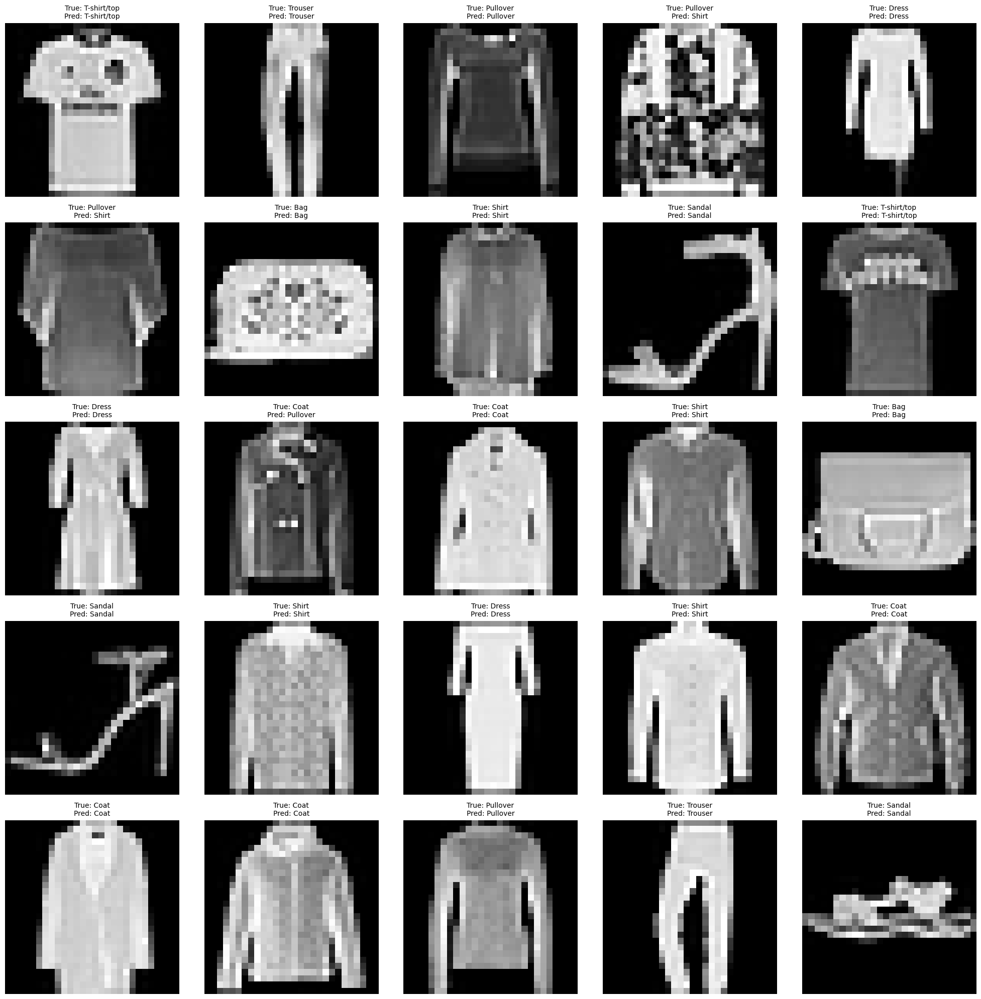

# Fashion MNIST Classification

This project demonstrates the use of a Convolutional Neural Network (CNN) to classify images from the Fashion MNIST dataset. The dataset contains grayscale images of various fashion items, categorized into 10 different classes.

## Overview

The model is designed to classify fashion items such as T-shirts, trousers, pullovers, dresses, and more. It achieves an accuracy of 89% on the test dataset.

## Dataset

The dataset used in this project is available on Kaggle at the following link: [Fashion MNIST Dataset](https://www.kaggle.com/datasets/hiteshk07/fashionmnist-dsc).
- `fashion-mnist_train.csv`: Contains the training data.
- `fashion-mnist_test.csv`: Contains the test data.

## Model Overview

The model is built using a Sequential CNN architecture with the following layers:
1. **Conv2D Layers**: Extracts features from the input images using convolution operations.
2. **MaxPooling2D Layers**: Reduces the spatial dimensions of the feature maps, retaining the most important features.
3. **Flatten Layer**: Converts the 2D feature maps into a 1D vector, preparing it for the fully connected layers.
4. **Dense Layers**: Performs the final classification into one of the 10 classes.
5. **Dropout Layer**: Helps in reducing overfitting by randomly setting a fraction of input units to zero during training.

## Training and Evaluation

- **Training Data**: The model is trained on the Fashion MNIST training set.
- **Test Data**: The test set is used to evaluate the model's performance.
- **Accuracy**: The model achieved 89% accuracy on the test set.

## Results Visualization

Various visualizations were generated during the training and evaluation process:

1. **Accuracy and Loss Curves**: Graphs showing the model's accuracy and loss over epochs for both training and validation datasets.
   
2. **Confusion Matrix**: A heatmap showing the performance of the model in correctly classifying each class.
 
3. **Sample Predictions**: A grid of sample images with their true labels and the model's predictions.

## Usage

To run this project in Google Colab, upload your dataset CSV files and ensure the file paths are correctly set. The model can be trained and evaluated using the provided code.

## Areas of Improvement

While the model achieved an accuracy of 89%, there are certain areas where it can be improved:

### Problem
The model tends to confuse between similar clothing items, particularly between shirts and t-shirts, as well as shirts and coats. This indicates that the current model may not be extracting complex enough features to accurately distinguish between these similar items.

### Solution
To address this issue, more complex feature extraction techniques may be required. Potential solutions include:
- **Deeper Layers:** Incorporating more layers in the neural network to capture finer details and differences between classes.
- **Transfer Learning:** Leveraging pre-trained models to benefit from learned features in similar tasks and improve classification accuracy for challenging classes.

These improvements could help the model better differentiate between similar clothing items and enhance overall performance.

## Conclusion

This project provides an effective approach to classifying fashion items using a CNN. The model's performance could be further improved by fine-tuning hyperparameters, adding more data, or experimenting with different model architectures.

